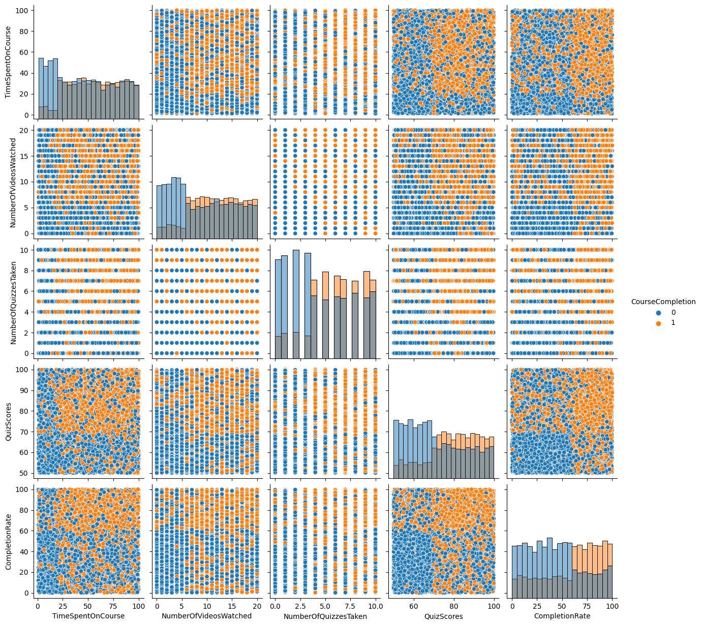
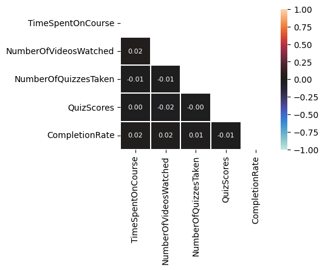
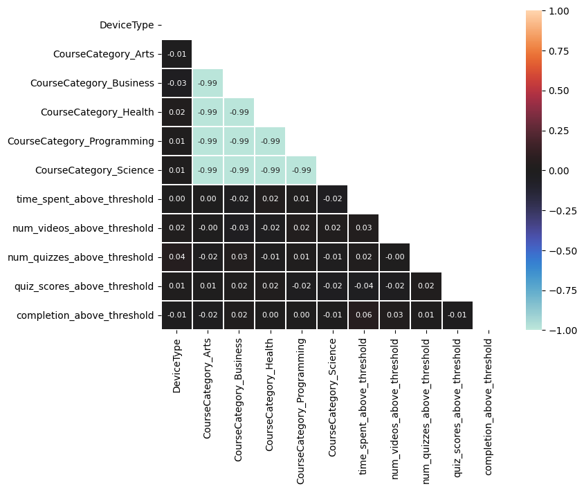
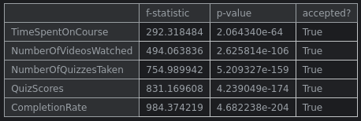
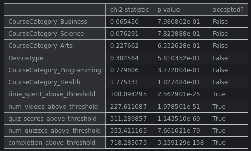
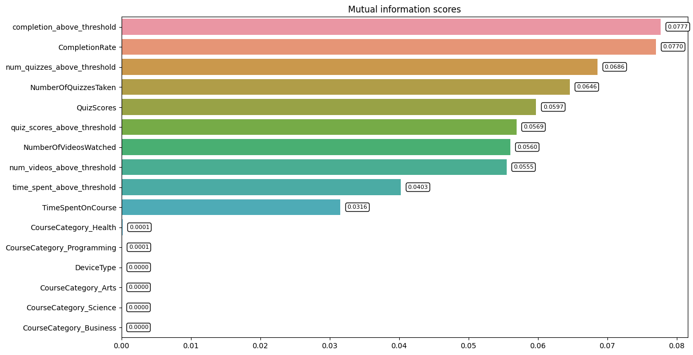

## **Online Course Engagement**

### 🎯 **Goal**

Predicting online course completion status based on user demographics and course-specific engagement metrics.

### 🧵 **Dataset**

[Predict Online Course Engagement Dataset](https://www.kaggle.com/datasets/rabieelkharoua/predict-online-course-engagement-dataset)

### 🧾 **Description**

This dataset captures user engagement metrics from an online course platform, facilitating analyses on factors influencing course completion. It includes user demographics, course-specific data, and engagement metrics. The problem is binary classification of course completion status based on the available data.

### 🧮 **What I have done**

1. Exploratory analysis of features: cleaning, preprocessing and data visualization.
2. Feature engineering: discretizing numerical features.
3. Feature selection: statistical tests, model-based feature importances.
4. Created a holdout set for testing all the models using Stratified sampling to maintain imbalance ratio.
5. Training a simple linear model as baseline, using a standard modeling framework to be used for other models.
6. Training and validation using different feature sets: discriminant analysis, naive bayes, K-nearest neighbours, tree models, tree ensembles, gradient-boosting trees and neural networks.
7. Models were tuned and evaluated based on accuracy score and ROC-AUC score, since the target classes are fairly balanced.
8. Created a Streamlit web app to provide an interface for testing new data points with appropriate input methods. For inference, the best model is chosen.

### 🚀 **Models Implemented**

* Linear models: Logistic Regression (baseline model), Linear Discriminant Analysis
* Quadratic Discriminant Analysis
* Naive Bayes: Gaussian, Bernoulli
* K-Nearest Neighbours
* Decision-tree
* Tree ensembles: Random Forest, Extra-Trees Classifier, Bagging Classifier
* Gradient-boosting models: AdaBoost (best model), Hist-Gradient Boosting, XGBoost, CatBoost
* Neural network: Multi-layer Perceptron
* Model Ensembling: Voting Classifier, Stacking Classifier

### 📚 **Libraries Needed**

* Pandas
* Numpy
* Scikit-learn
* XGBoost
* CatBoost
* Matplotlib
* Seaborn
* Joblib

### 📊 **Exploratory Data Analysis Results**

**Univariate analysis**:  

**Bivariate analysis**:

**Feature selection**:

### 📈 **Performance of the Models based on the Accuracy Scores**

Each model has **four** variations, one for each feature set: original (O), extended (E), binary (B) and minimal (M).  
Only the best variation is included in the table. In most cases, the extended feature set, which consists of original features  
along with the engineered features, resulted in the best performance. In special cases where other feature sets performed better, it is mentioned with the model.

| Model configuration | Accuracy (%) | ROC-AUC Score
|:-----:|:-----:|:-----:|:-----:
| Logistic Regression | 94.83 | 0.9630
| Linear Discriminant Analysis | 94.83 | 0.9597
| Quadratic Discriminant Analysis | 93.48 | 0.9593
| Bernoulli Naive Bayes (B) | 94.83 | 0.9582
| K-Nearest Neighbours (M) | 94.83 | 0.9496
| Decision Tree | 95.94 | 0.9660
| Random Forest (O) | 96.43 | 0.9612
| AdaBoost Classifier | **96.43** | **0.9660**
| Hist-Gradient Boosting (O) | 96.31 | 0.9659
| Multi-layer Perceptron | 94.96 | 0.9578
| XGBoost (O) | 96.43 | 0.9599
| CatBoost | 96.43 | 0.9625
| Soft-Voting | 96.43 | 0.9643
| Stacking without passthrough | 96.43 | 0.9644
| Stacking with passthrough | 96.43 | 0.9632

### 📢 **Conclusion**

After comparing a variety of models based on accuracy and ROC-AUC score, the best performance was shown by AdaBoost. The best model was used for inference in a Streamlit web app to test new data points.

### ✒️ **Your Signature**

Siddhant Tiwari  
([Github](https://www.github.com/siddhant4ds) - [Kaggle](https://www.kaggle.com/sid4ds) - [LinkedIn](https://www.linkedin.com/in/siddhant-tiwari-ds/))
